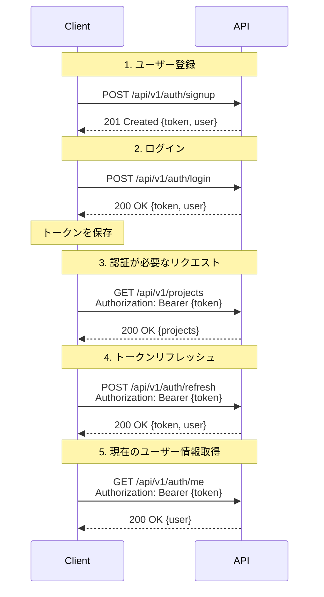

# API設計書

## 概要

RESTful APIの設計仕様書。すべてのエンドポイントは`/api/v1`プレフィックスを持つ。

**ベースURL**: `http://localhost:3000/api/v1`

**認証方式**: JWT (JSON Web Token)

**レスポンス形式**: JSON

---

## 認証フロー



---

## 認証API

### POST /api/v1/auth/signup

ユーザー登録

**認証**: 不要

**リクエスト**:
```json
{
  "user": {
    "name": "山田太郎",
    "email": "yamada@example.com",
    "password": "password123",
    "password_confirmation": "password123"
  }
}
```

**レスポンス** (201 Created):
```json
{
  "token": "eyJhbGciOiJIUzI1NiIsInR5cCI6IkpXVCJ9...",
  "user": {
    "id": 1,
    "name": "山田太郎",
    "email": "yamada@example.com",
    "created_at": "2026-01-20T12:00:00.000Z"
  }
}
```

**エラーレスポンス** (422 Unprocessable Entity):
```json
{
  "errors": {
    "email": ["はすでに存在します"],
    "password": ["は6文字以上で入力してください"]
  }
}
```

---

### POST /api/v1/auth/login

ログイン

**認証**: 不要

**リクエスト**:
```json
{
  "email": "yamada@example.com",
  "password": "password123"
}
```

**レスポンス** (200 OK):
```json
{
  "token": "eyJhbGciOiJIUzI1NiIsInR5cCI6IkpXVCJ9...",
  "user": {
    "id": 1,
    "name": "山田太郎",
    "email": "yamada@example.com",
    "created_at": "2026-01-20T12:00:00.000Z"
  }
}
```

**エラーレスポンス** (401 Unauthorized):
```json
{
  "error": "メールアドレスまたはパスワードが正しくありません"
}
```

---

### POST /api/v1/auth/refresh

トークンリフレッシュ

**認証**: 必要

**ヘッダー**:
```
Authorization: Bearer {token}
```

**レスポンス** (200 OK):
```json
{
  "token": "eyJhbGciOiJIUzI1NiIsInR5cCI6IkpXVCJ9...",
  "user": {
    "id": 1,
    "name": "山田太郎",
    "email": "yamada@example.com",
    "created_at": "2026-01-20T12:00:00.000Z"
  }
}
```

---

### GET /api/v1/auth/me

現在のユーザー情報取得

**認証**: 必要

**ヘッダー**:
```
Authorization: Bearer {token}
```

**レスポンス** (200 OK):
```json
{
  "id": 1,
  "name": "山田太郎",
  "email": "yamada@example.com",
  "created_at": "2026-01-20T12:00:00.000Z"
}
```

---

## プロジェクトAPI

### GET /api/v1/projects

プロジェクト一覧取得

**認証**: 必要

**クエリパラメータ**:
- `page` (optional): ページ番号 (デフォルト: 1)
- `per_page` (optional): 1ページあたりの件数 (デフォルト: 20)

**レスポンス** (200 OK):
```json
{
  "projects": [
    {
      "id": 1,
      "name": "Webサイトリニューアル",
      "description": "コーポレートサイトの全面リニューアル",
      "tasks_count": 15,
      "total_duration": 86400,
      "created_at": "2026-01-15T10:00:00.000Z",
      "updated_at": "2026-01-20T12:00:00.000Z"
    }
  ],
  "meta": {
    "current_page": 1,
    "total_pages": 3,
    "total_count": 45
  }
}
```

---

### POST /api/v1/projects

プロジェクト作成

**認証**: 必要

**リクエスト**:
```json
{
  "project": {
    "name": "新規プロジェクト",
    "description": "プロジェクトの説明"
  }
}
```

**レスポンス** (201 Created):
```json
{
  "id": 2,
  "name": "新規プロジェクト",
  "description": "プロジェクトの説明",
  "tasks_count": 0,
  "total_duration": 0,
  "created_at": "2026-01-20T13:00:00.000Z",
  "updated_at": "2026-01-20T13:00:00.000Z"
}
```

**エラーレスポンス** (422 Unprocessable Entity):
```json
{
  "errors": {
    "name": ["を入力してください"]
  }
}
```

---

### GET /api/v1/projects/:id

プロジェクト詳細取得

**認証**: 必要

**レスポンス** (200 OK):
```json
{
  "id": 1,
  "name": "Webサイトリニューアル",
  "description": "コーポレートサイトの全面リニューアル",
  "tasks_count": 15,
  "total_duration": 86400,
  "created_at": "2026-01-15T10:00:00.000Z",
  "updated_at": "2026-01-20T12:00:00.000Z",
  "tasks": [
    {
      "id": 1,
      "title": "デザイン作成",
      "status": "done",
      "time_entries_count": 5,
      "total_duration": 14400
    }
  ]
}
```

**エラーレスポンス** (404 Not Found):
```json
{
  "error": "プロジェクトが見つかりません"
}
```

---

### PUT /api/v1/projects/:id

プロジェクト更新

**認証**: 必要

**リクエスト**:
```json
{
  "project": {
    "name": "更新されたプロジェクト名",
    "description": "更新された説明"
  }
}
```

**レスポンス** (200 OK):
```json
{
  "id": 1,
  "name": "更新されたプロジェクト名",
  "description": "更新された説明",
  "tasks_count": 15,
  "total_duration": 86400,
  "created_at": "2026-01-15T10:00:00.000Z",
  "updated_at": "2026-01-20T13:00:00.000Z"
}
```

---

### DELETE /api/v1/projects/:id

プロジェクト削除

**認証**: 必要

**レスポンス** (204 No Content):
```
(空のレスポンス)
```

**注意**: カスケード削除により、関連するタスクと時間記録もすべて削除されます。

---

## タスクAPI

### GET /api/v1/projects/:project_id/tasks

プロジェクトのタスク一覧取得

**認証**: 必要

**クエリパラメータ**:
- `status` (optional): ステータスフィルター (todo/in_progress/done)
- `page` (optional): ページ番号
- `per_page` (optional): 1ページあたりの件数

**レスポンス** (200 OK):
```json
{
  "tasks": [
    {
      "id": 1,
      "title": "デザイン作成",
      "description": "トップページのデザイン",
      "status": "done",
      "project_id": 1,
      "time_entries_count": 5,
      "total_duration": 14400,
      "created_at": "2026-01-15T10:00:00.000Z",
      "updated_at": "2026-01-18T15:00:00.000Z"
    }
  ],
  "meta": {
    "current_page": 1,
    "total_pages": 2,
    "total_count": 15
  }
}
```

---

### POST /api/v1/projects/:project_id/tasks

タスク作成

**認証**: 必要

**リクエスト**:
```json
{
  "task": {
    "title": "新しいタスク",
    "description": "タスクの説明",
    "status": "todo"
  }
}
```

**レスポンス** (201 Created):
```json
{
  "id": 16,
  "title": "新しいタスク",
  "description": "タスクの説明",
  "status": "todo",
  "project_id": 1,
  "time_entries_count": 0,
  "total_duration": 0,
  "created_at": "2026-01-20T13:00:00.000Z",
  "updated_at": "2026-01-20T13:00:00.000Z"
}
```

---

### GET /api/v1/tasks/:id

タスク詳細取得

**認証**: 必要

**レスポンス** (200 OK):
```json
{
  "id": 1,
  "title": "デザイン作成",
  "description": "トップページのデザイン",
  "status": "done",
  "project_id": 1,
  "project_name": "Webサイトリニューアル",
  "time_entries_count": 5,
  "total_duration": 14400,
  "created_at": "2026-01-15T10:00:00.000Z",
  "updated_at": "2026-01-18T15:00:00.000Z",
  "time_entries": [
    {
      "id": 1,
      "started_at": "2026-01-15T10:00:00.000Z",
      "ended_at": "2026-01-15T13:00:00.000Z",
      "duration": 10800
    }
  ]
}
```

---

### PUT /api/v1/tasks/:id

タスク更新

**認証**: 必要

**リクエスト**:
```json
{
  "task": {
    "title": "更新されたタスク名",
    "description": "更新された説明",
    "status": "in_progress"
  }
}
```

**レスポンス** (200 OK):
```json
{
  "id": 1,
  "title": "更新されたタスク名",
  "description": "更新された説明",
  "status": "in_progress",
  "project_id": 1,
  "time_entries_count": 5,
  "total_duration": 14400,
  "created_at": "2026-01-15T10:00:00.000Z",
  "updated_at": "2026-01-20T13:00:00.000Z"
}
```

---

### DELETE /api/v1/tasks/:id

タスク削除

**認証**: 必要

**レスポンス** (204 No Content):
```
(空のレスポンス)
```

---

## 時間記録API

### GET /api/v1/tasks/:task_id/time_entries

タスクの時間記録一覧取得

**認証**: 必要

**クエリパラメータ**:
- `page` (optional): ページ番号
- `per_page` (optional): 1ページあたりの件数

**レスポンス** (200 OK):
```json
{
  "time_entries": [
    {
      "id": 1,
      "started_at": "2026-01-15T10:00:00.000Z",
      "ended_at": "2026-01-15T13:00:00.000Z",
      "duration": 10800,
      "task_id": 1,
      "created_at": "2026-01-15T10:00:00.000Z",
      "updated_at": "2026-01-15T13:00:00.000Z"
    }
  ],
  "meta": {
    "current_page": 1,
    "total_pages": 1,
    "total_count": 5
  }
}
```

---

### POST /api/v1/tasks/:task_id/time_entries

時間記録開始

**認証**: 必要

**リクエスト**:
```json
{
  "time_entry": {
    "started_at": "2026-01-20T13:00:00.000Z"
  }
}
```

**レスポンス** (201 Created):
```json
{
  "id": 6,
  "started_at": "2026-01-20T13:00:00.000Z",
  "ended_at": null,
  "duration": null,
  "task_id": 1,
  "created_at": "2026-01-20T13:00:00.000Z",
  "updated_at": "2026-01-20T13:00:00.000Z"
}
```

**注意**: `ended_at`と`duration`がnullの場合、計測中を表します。

---

### PUT /api/v1/time_entries/:id/stop

時間記録停止

**認証**: 必要

**リクエスト**:
```json
{
  "ended_at": "2026-01-20T15:30:00.000Z"
}
```

**レスポンス** (200 OK):
```json
{
  "id": 6,
  "started_at": "2026-01-20T13:00:00.000Z",
  "ended_at": "2026-01-20T15:30:00.000Z",
  "duration": 9000,
  "task_id": 1,
  "created_at": "2026-01-20T13:00:00.000Z",
  "updated_at": "2026-01-20T15:30:00.000Z"
}
```

**注意**: `duration`は自動計算されます(秒単位)。

---

### DELETE /api/v1/time_entries/:id

時間記録削除

**認証**: 必要

**レスポンス** (204 No Content):
```
(空のレスポンス)
```

---

## レポートAPI

### GET /api/v1/reports/summary

サマリーレポート取得

**認証**: 必要

**クエリパラメータ**:
- `start_date` (optional): 開始日 (YYYY-MM-DD)
- `end_date` (optional): 終了日 (YYYY-MM-DD)
- `project_id` (optional): プロジェクトIDでフィルター

**レスポンス** (200 OK):
```json
{
  "summary": {
    "total_projects": 5,
    "total_tasks": 45,
    "total_duration": 432000,
    "total_duration_hours": 120.0,
    "tasks_by_status": {
      "todo": 15,
      "in_progress": 10,
      "done": 20
    }
  },
  "projects": [
    {
      "id": 1,
      "name": "Webサイトリニューアル",
      "total_duration": 86400,
      "total_duration_hours": 24.0,
      "tasks_count": 15,
      "completed_tasks_count": 8
    }
  ],
  "daily_breakdown": [
    {
      "date": "2026-01-20",
      "total_duration": 28800,
      "total_duration_hours": 8.0,
      "tasks_worked": 5
    }
  ]
}
```

---

## エラーレスポンス

### 401 Unauthorized

認証エラー

```json
{
  "error": "認証が必要です"
}
```

または

```json
{
  "error": "トークンが無効です"
}
```

---

### 403 Forbidden

認可エラー

```json
{
  "error": "このリソースにアクセスする権限がありません"
}
```

---

### 404 Not Found

リソースが見つからない

```json
{
  "error": "リソースが見つかりません"
}
```

---

### 422 Unprocessable Entity

バリデーションエラー

```json
{
  "errors": {
    "name": ["を入力してください"],
    "email": ["は不正な値です", "はすでに存在します"]
  }
}
```

---

### 500 Internal Server Error

サーバーエラー

```json
{
  "error": "サーバーエラーが発生しました"
}
```

---

## HTTPステータスコード一覧

| コード | 意味 | 使用例 |
|-------|------|--------|
| 200 | OK | 取得・更新成功 |
| 201 | Created | 作成成功 |
| 204 | No Content | 削除成功 |
| 400 | Bad Request | リクエストが不正 |
| 401 | Unauthorized | 認証エラー |
| 403 | Forbidden | 認可エラー |
| 404 | Not Found | リソースが見つからない |
| 422 | Unprocessable Entity | バリデーションエラー |
| 500 | Internal Server Error | サーバーエラー |

---

## レート制限(将来実装予定)

- **制限**: 1時間あたり1000リクエスト
- **ヘッダー**:
  - `X-RateLimit-Limit`: 制限数
  - `X-RateLimit-Remaining`: 残り回数
  - `X-RateLimit-Reset`: リセット時刻(Unix timestamp)

---

## バージョニング

現在のバージョン: `v1`

将来的に破壊的変更が必要な場合は`/api/v2`を作成し、`v1`は一定期間サポートを継続します。

---

## CORS設定

**許可されたオリジン**:
- 開発環境: `http://localhost:5173`
- 本番環境: 環境変数で設定

**許可されたメソッド**:
- GET, POST, PUT, DELETE, OPTIONS

**許可されたヘッダー**:
- Authorization, Content-Type

**Credentials**: 許可

---

## まとめ

このAPI設計は以下を実現します:

✅ **RESTful**: リソース指向の設計  
✅ **セキュア**: JWT認証、適切な認可  
✅ **一貫性**: 統一されたレスポンス形式  
✅ **エラーハンドリング**: 明確なエラーメッセージ  
✅ **拡張性**: バージョニング、ページネーション  
✅ **ドキュメント**: 詳細な仕様書  
