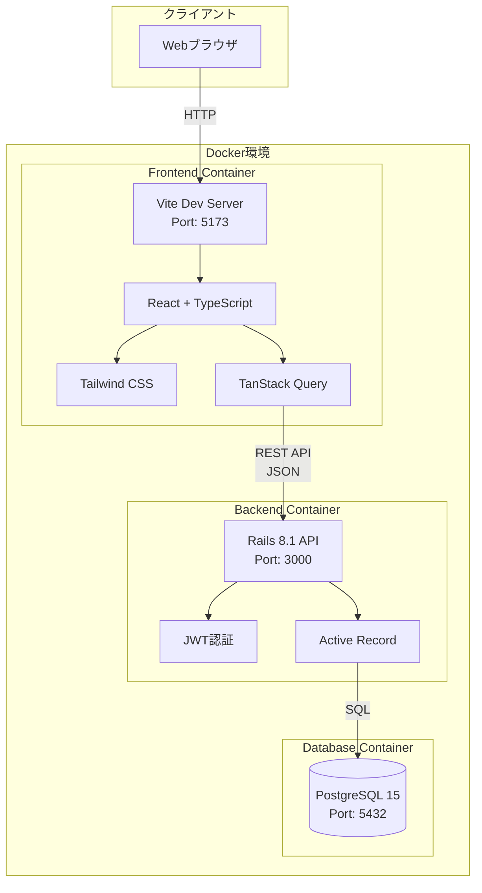
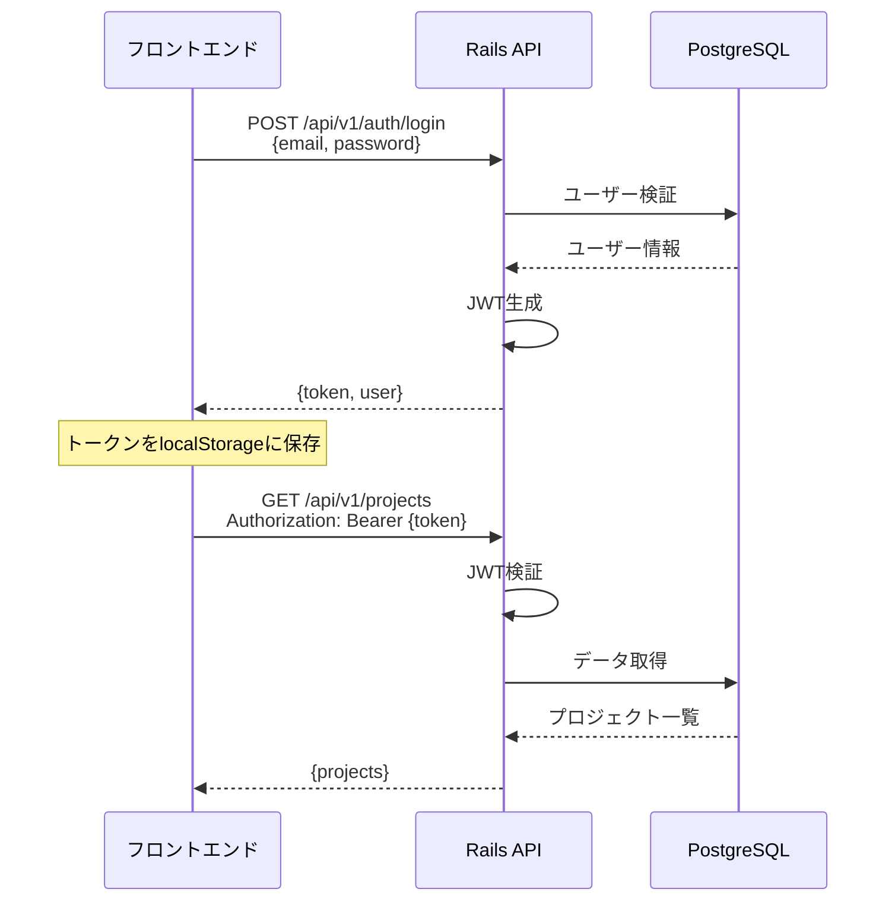
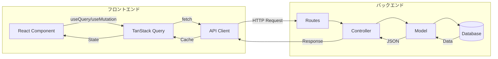

# アーキテクチャ設計書

## システム概要

フリーランス向けタスク管理 & 時間トラッキングアプリケーション

**設計思想**: マイクロサービス的な疎結合アーキテクチャ
- フロントエンドとバックエンドを完全分離
- RESTful APIによる通信
- Docker Composeによるコンテナオーケストレーション

## システム構成図



## 技術スタック

### フロントエンド
| 技術 | バージョン | 用途 |
|------|-----------|------|
| React | 19.2.0 | UIライブラリ |
| TypeScript | 5.9.3 | 型安全性 |
| Vite | 7.2.4 | ビルドツール |
| Tailwind CSS | 4.1.18 | CSSフレームワーク |
| TanStack Query | 5.90.19 | サーバーステート管理 |
| React Router | 7.12.0 | ルーティング |
| Vitest | 4.0.17 | テストフレームワーク |
| React Testing Library | 16.3.2 | コンポーネントテスト |

### バックエンド
| 技術 | バージョン | 用途 |
|------|-----------|------|
| Ruby | 3.2.2 | プログラミング言語 |
| Rails | 8.1.2 | APIフレームワーク |
| PostgreSQL | 17 | データベース |
| bcrypt | 3.1.7 | パスワードハッシュ化 |
| jwt | 2.10 | JWT認証 |
| rack-cors | - | CORS設定 |
| RSpec | 6.0 | テストフレームワーク |
| FactoryBot | - | テストデータ生成 |
| SimpleCov | - | カバレッジ測定 |

### インフラ
| 技術 | 用途 |
|------|------|
| Docker | コンテナ化 |
| Docker Compose | マルチコンテナ管理 |

## アーキテクチャの特徴

### 1. 完全分離アーキテクチャ

**フロントエンド (Port: 5173)**
- Vite開発サーバーで独立稼働
- React SPAとして動作
- バックエンドとはREST APIのみで通信

**バックエンド (Port: 3000)**
- Rails APIモード(Viewレイヤーなし)
- JSON APIのみを提供
- ステートレス設計

**メリット**:
- フロント・バックの独立した開発・デプロイが可能
- 技術スタックの柔軟な変更
- スケーラビリティの向上
- マイクロサービスへの移行が容易

### 2. セキュリティ設計

#### JWT認証フロー


#### セキュリティ対策
- **パスワード**: bcryptでハッシュ化(cost: 12)
- **認証**: JWT(JSON Web Token)
- **CORS**: 許可されたオリジンのみアクセス可能
- **環境変数**: シークレットキーは環境変数で管理
- **SQL Injection**: Active Recordのパラメータバインディング
- **XSS**: Reactの自動エスケープ

### 3. データフロー



### 4. Docker構成

#### docker-compose.yml
```yaml
services:
  db:
    - PostgreSQL 15
    - データ永続化(volume)
    
  backend:
    - Rails API
    - db依存
    - ポート3000公開
    
  frontend:
    - Vite + React
    - ポート5173公開
    - ホットリロード対応
```

#### ネットワーク
- すべてのコンテナは同一Dockerネットワーク内
- フロントエンド → バックエンド: `http://localhost:3000`
- バックエンド → DB: `postgresql://db:5432`

### 5. 状態管理戦略

#### フロントエンド
- **サーバーステート**: TanStack Query
  - APIデータのキャッシング
  - 自動再取得
  - 楽観的更新
- **UIステート**: React useState/useReducer
  - フォーム入力
  - モーダル表示状態
- **ルーティング**: React Router
  - ページ遷移
  - 認証ガード

#### バックエンド
- **ステートレス**: セッションを持たない
- **JWT**: 認証状態をトークンで管理
- **データベース**: すべての永続データ

## スケーラビリティ

### 水平スケーリング
- **フロントエンド**: CDN配信可能
- **バックエンド**: ロードバランサー配下で複数インスタンス
- **データベース**: レプリケーション・シャーディング

### 将来の拡張性
- **マイクロサービス化**: 認証サービス、レポートサービスなどに分割可能
- **メッセージキュー**: 非同期処理の追加
- **キャッシュレイヤー**: Redis導入
- **API Gateway**: 複数バックエンドの統合

## 開発環境

### ローカル開発
```bash
# すべてのサービスを起動
docker-compose up

# フロントエンド: http://localhost:5173
# バックエンド: http://localhost:3000
# PostgreSQL: localhost:5432
```

### ホットリロード
- **フロントエンド**: Viteの高速HMR
- **バックエンド**: ボリュームマウントでコード変更を即反映

## デプロイ戦略(想定)

### フロントエンド
- **Vercel** / **Netlify**: 静的ビルド配信
- 環境変数でAPIエンドポイント切り替え

### バックエンド
- **Heroku** / **Render** / **AWS ECS**: Dockerコンテナデプロイ
- 環境変数でDB接続・JWT秘密鍵管理

### データベース
- **AWS RDS** / **Heroku Postgres**: マネージドPostgreSQL

## パフォーマンス最適化

### フロントエンド
- コード分割(React.lazy)
- 画像最適化
- TanStack Queryのキャッシュ戦略
- Tailwind CSSのPurge

### バックエンド
- データベースインデックス
- N+1クエリ対策(includes/joins)
- ページネーション
- JSONシリアライズ最適化

## テスト戦略

### フロントエンド
- **フレームワーク**: Vitest + React Testing Library
- **カバレッジ**: 97.59% (Statements), 93.02% (Branch), 100% (Functions)
- **テスト対象**:
  - コンポーネント単体テスト
  - ユーティリティ関数テスト
  - ユーザーインタラクションテスト
- **実行コマンド**:
  ```bash
  npm test              # テスト実行
  npm run test:coverage # カバレッジ測定
  npm run test:ui       # UIモード
  ```

### バックエンド
- **フレームワーク**: RSpec
- **テスト対象**:
  - モデルテスト（バリデーション、アソシエーション）
  - リクエストテスト（APIエンドポイント）
  - 認証・認可テスト
- **実行コマンド**:
  ```bash
  bundle exec rspec     # テスト実行
  ```

### テスト駆動開発(TDD)
- 新機能追加時はテストファーストで開発
- リファクタリング時の安全性確保
- CI/CDパイプラインでの自動テスト実行（将来実装予定）

## 監視・ログ

### 開発環境
- **フロントエンド**: ブラウザDevTools、React DevTools
- **バックエンド**: Railsログ、PostgreSQLログ
- **Docker**: `docker-compose logs`

### 本番環境(想定)
- **APM**: New Relic / Datadog
- **エラートラッキング**: Sentry
- **ログ集約**: CloudWatch / Papertrail

## まとめ

このアーキテクチャは以下を実現します:

✅ **疎結合**: フロント・バックの完全分離  
✅ **スケーラブル**: 各レイヤーの独立スケーリング  
✅ **保守性**: 明確な責任分離  
✅ **セキュア**: JWT認証、CORS、パスワードハッシュ化  
✅ **開発効率**: Docker環境、ホットリロード  
✅ **モダン**: 最新技術スタックの採用  

企業が求める**マイクロサービス的な設計思想**を体現したポートフォリオアプリケーションです。
