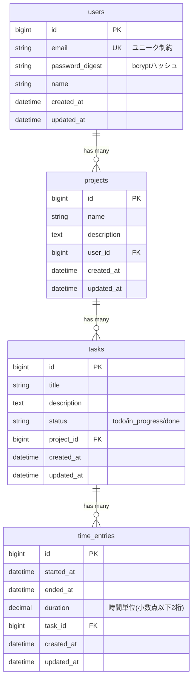

# データベース設計書

## ER図



## テーブル定義

### users テーブル

ユーザー情報を管理するテーブル。認証機能を持つ。

| カラム名 | 型 | NULL | デフォルト | 説明 |
|---------|-----|------|-----------|------|
| id | bigint | NO | auto | 主キー |
| email | string | NO | - | メールアドレス(ログインID) |
| password_digest | string | NO | - | bcryptでハッシュ化されたパスワード |
| name | string | NO | - | ユーザー名 |
| created_at | datetime | NO | CURRENT_TIMESTAMP | 作成日時 |
| updated_at | datetime | NO | CURRENT_TIMESTAMP | 更新日時 |

**制約**:
- PRIMARY KEY: `id`
- UNIQUE: `email`
- INDEX: `email` (ログイン時の検索用)

**バリデーション**:
- email: 必須、メール形式、ユニーク
- password: 必須、最小6文字
- name: 必須

**セキュリティ**:
- `has_secure_password`でbcrypt自動ハッシュ化
- パスワードは平文保存しない

---

### projects テーブル

プロジェクト情報を管理するテーブル。

| カラム名 | 型 | NULL | デフォルト | 説明 |
|---------|-----|------|-----------|------|
| id | bigint | NO | auto | 主キー |
| name | string | NO | - | プロジェクト名 |
| description | text | YES | NULL | プロジェクト説明 |
| user_id | bigint | NO | - | 外部キー(users) |
| created_at | datetime | NO | CURRENT_TIMESTAMP | 作成日時 |
| updated_at | datetime | NO | CURRENT_TIMESTAMP | 更新日時 |

**制約**:
- PRIMARY KEY: `id`
- FOREIGN KEY: `user_id` REFERENCES `users(id)` ON DELETE CASCADE
- INDEX: `user_id` (ユーザーのプロジェクト一覧取得用)
- COMPOSITE INDEX: `(user_id, name)` (ユーザー内での名前検索用)

**バリデーション**:
- name: 必須
- user_id: 必須、存在するユーザー

**リレーション**:
- `belongs_to :user`
- `has_many :tasks, dependent: :destroy`

---

### tasks テーブル

タスク情報を管理するテーブル。ステータス管理機能を持つ。

| カラム名 | 型 | NULL | デフォルト | 説明 |
|---------|-----|------|-----------|------|
| id | bigint | NO | auto | 主キー |
| title | string | NO | - | タスク名 |
| description | text | YES | NULL | タスク説明 |
| status | string | NO | 'todo' | ステータス(todo/in_progress/done) |
| project_id | bigint | NO | - | 外部キー(projects) |
| created_at | datetime | NO | CURRENT_TIMESTAMP | 作成日時 |
| updated_at | datetime | NO | CURRENT_TIMESTAMP | 更新日時 |

**制約**:
- PRIMARY KEY: `id`
- FOREIGN KEY: `project_id` REFERENCES `projects(id)` ON DELETE CASCADE
- INDEX: `project_id` (プロジェクトのタスク一覧取得用)
- COMPOSITE INDEX: `(project_id, status)` (ステータス別タスク取得用)

**バリデーション**:
- title: 必須
- status: 必須、enum値(todo/in_progress/done)のみ
- project_id: 必須、存在するプロジェクト

**リレーション**:
- `belongs_to :project`
- `has_many :time_entries, dependent: :destroy`

**ステータス遷移**:
```
todo → in_progress → done
  ↓         ↓          ↓
  ←---------←----------←
```

---

### time_entries テーブル

時間記録を管理するテーブル。作業時間の自動計算機能を持つ。

| カラム名 | 型 | NULL | デフォルト | 説明 |
|---------|-----|------|-----------|------|
| id | bigint | NO | auto | 主キー |
| started_at | datetime | NO | - | 開始日時 |
| ended_at | datetime | NO | - | 終了日時 |
| duration | decimal(10,2) | NO | - | 作業時間(時間単位、小数点以下2桁) |
| task_id | bigint | NO | - | 外部キー(tasks) |
| created_at | datetime | NO | CURRENT_TIMESTAMP | 作成日時 |
| updated_at | datetime | NO | CURRENT_TIMESTAMP | 更新日時 |

**制約**:
- PRIMARY KEY: `id`
- FOREIGN KEY: `task_id` REFERENCES `tasks(id)` ON DELETE CASCADE
- INDEX: `task_id` (タスクの時間記録一覧取得用)
- COMPOSITE INDEX: `(task_id, started_at)` (時系列での取得用)
- INDEX: `ended_at` (進行中の記録検索用)

**バリデーション**:
- started_at: 必須
- ended_at: 必須、終了時刻 > 開始時刻(カスタムバリデーション)
- duration: 必須、0より大きい数値
- task_id: 必須、存在するタスク

**リレーション**:
- `belongs_to :task`

**自動計算**:
- 保存前に`duration`を自動計算(`before_validation`コールバック)
- `duration = ((ended_at - started_at) / 3600.0).round(2)` (時間単位、小数点以下2桁)
- 例: 1時間30分 = 1.5、2時間45分 = 2.75

---

## インデックス設計

### 単一カラムインデックス

| テーブル | カラム | 目的 |
|---------|--------|------|
| users | email | ログイン時の高速検索 |
| projects | user_id | ユーザーのプロジェクト一覧取得 |
| tasks | project_id | プロジェクトのタスク一覧取得 |
| time_entries | task_id | タスクの時間記録一覧取得 |
| time_entries | ended_at | 進行中の記録検索 |

### 複合インデックス

| テーブル | カラム | 目的 |
|---------|--------|------|
| projects | (user_id, name) | ユーザー内でのプロジェクト名検索 |
| tasks | (project_id, status) | プロジェクト内でのステータス別タスク取得 |
| time_entries | (task_id, started_at) | タスクの時系列時間記録取得 |

### インデックス設計の意図

1. **頻繁なクエリの最適化**
   - ユーザーのプロジェクト一覧
   - プロジェクトのタスク一覧
   - タスクの時間記録一覧

2. **WHERE句の最適化**
   - ステータス別タスク検索
   - 進行中の時間記録検索

3. **ORDER BY句の最適化**
   - 時系列での時間記録取得

---

## リレーションシップ

### 1対多の関係

```
User (1) ----< (N) Project
Project (1) ----< (N) Task
Task (1) ----< (N) TimeEntry
```

### カスケード削除

- **User削除時**: 関連するすべてのProjectsが削除される
- **Project削除時**: 関連するすべてのTasksが削除される
- **Task削除時**: 関連するすべてのTimeEntriesが削除される

**理由**: データの整合性を保つため。孤立したレコードを防ぐ。

---

## データ整合性

### 外部キー制約

すべての外部キーに`ON DELETE CASCADE`を設定:
- データの整合性を保証
- 孤立レコードの防止
- アプリケーション側での削除処理が不要

### バリデーション

**データベースレベル**:
- NOT NULL制約
- UNIQUE制約
- FOREIGN KEY制約

**アプリケーションレベル**:
- Railsモデルバリデーション
- カスタムバリデーション(終了時刻 > 開始時刻)
- 日本語エラーメッセージ

---

## パフォーマンス最適化

### N+1クエリ対策

```ruby
# 悪い例
projects = Project.all
projects.each do |project|
  puts project.tasks.count  # N+1発生
end

# 良い例
projects = Project.includes(:tasks)
projects.each do |project|
  puts project.tasks.count  # 1クエリで取得
end
```

### ページネーション

大量データ取得時は必ずページネーションを実装:
```ruby
# kaminari / pagy などのgemを使用
projects = Project.page(params[:page]).per(20)
```

### カウンタキャッシュ(将来の拡張)

頻繁にカウントする場合はカウンタキャッシュを検討:
```ruby
# projects テーブルに tasks_count カラムを追加
belongs_to :project, counter_cache: true
```

---

## セキュリティ考慮事項

### SQLインジェクション対策

- Active Recordのパラメータバインディングを使用
- 生SQLは極力避ける
- 必要な場合は`sanitize_sql`を使用

### パスワード管理

- bcryptでハッシュ化(cost: 12)
- 平文パスワードは保存しない
- `has_secure_password`で自動管理

### 認可

- ユーザーは自分のデータのみアクセス可能
- コントローラーで`current_user`を使用してスコープ制限

```ruby
# 良い例
@projects = current_user.projects

# 悪い例
@projects = Project.all  # 全ユーザーのデータが取得される
```

---

## マイグレーション履歴

| タイムスタンプ | ファイル名 | 内容 |
|--------------|-----------|------|
| 20260120124400 | create_users.rb | usersテーブル作成 |
| 20260120124500 | create_projects.rb | projectsテーブル作成 |
| 20260120124600 | create_tasks.rb | tasksテーブル作成 |
| 20260120124700 | create_time_entries.rb | time_entriesテーブル作成 |
| 20260120140545 | add_color_to_projects.rb | projectsテーブルにcolorカラム追加 |
| 20260120151950 | add_priority_and_due_date_to_tasks.rb | tasksテーブルにpriorityとdue_dateカラム追加 |
| 20260120154212 | add_description_to_time_entries.rb | time_entriesテーブルにdescriptionカラム追加 |
| 20260121085231 | change_duration_to_decimal_in_time_entries.rb | time_entriesのdurationをintegerからdecimal(10,2)に変更 |

---

## 将来の拡張性

### 追加予定の機能

1. **タグ機能**
   - `tags`テーブル
   - `taggings`テーブル(多対多の中間テーブル)

2. **チーム機能**
   - `teams`テーブル
   - `team_members`テーブル
   - プロジェクトの共有

3. **請求書機能**
   - `invoices`テーブル
   - 時間記録から自動生成

4. **通知機能**
   - `notifications`テーブル
   - タスク期限のリマインダー

### スケーラビリティ

- **パーティショニング**: time_entriesテーブルを日付でパーティション
- **レプリケーション**: 読み取り専用レプリカの追加
- **シャーディング**: ユーザーIDでシャーディング

---

## まとめ

このデータベース設計は以下を実現します:

✅ **正規化**: 第3正規形を満たす設計  
✅ **整合性**: 外部キー制約とカスケード削除  
✅ **パフォーマンス**: 適切なインデックス設計  
✅ **セキュリティ**: パスワードハッシュ化、SQLインジェクション対策  
✅ **拡張性**: 将来の機能追加を考慮した設計  
✅ **保守性**: 明確なリレーションシップと命名規則  

企業が評価する**堅牢で拡張性の高いデータベース設計**を体現しています。
